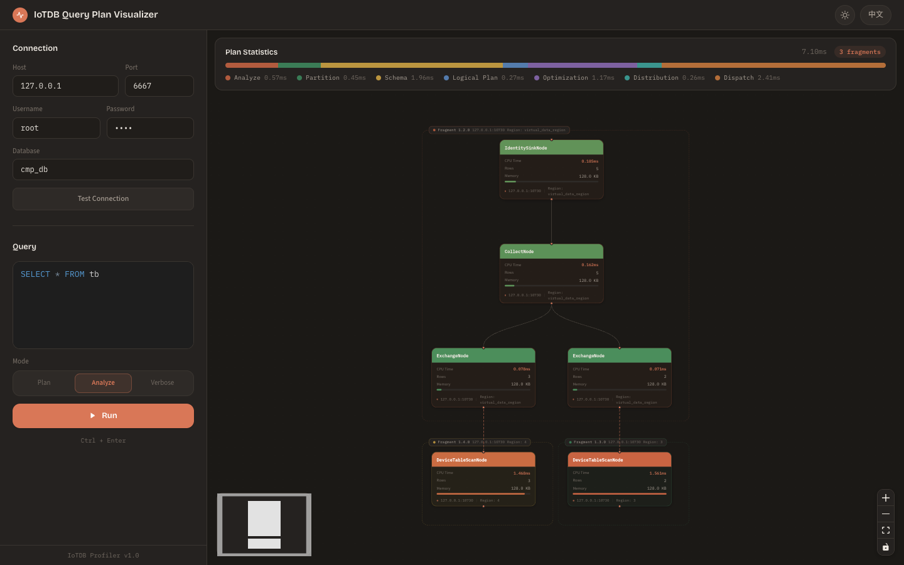
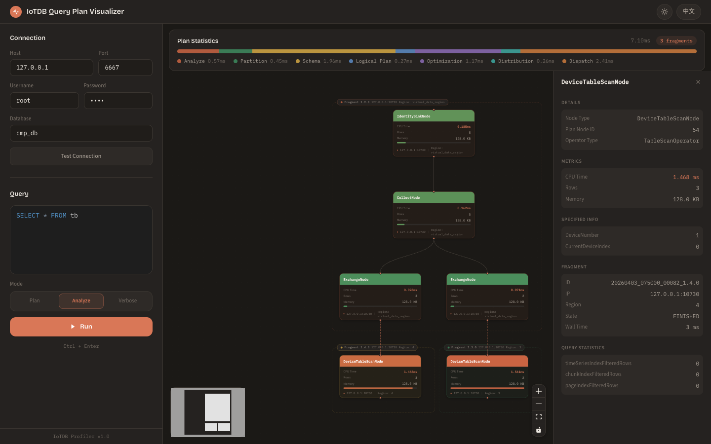
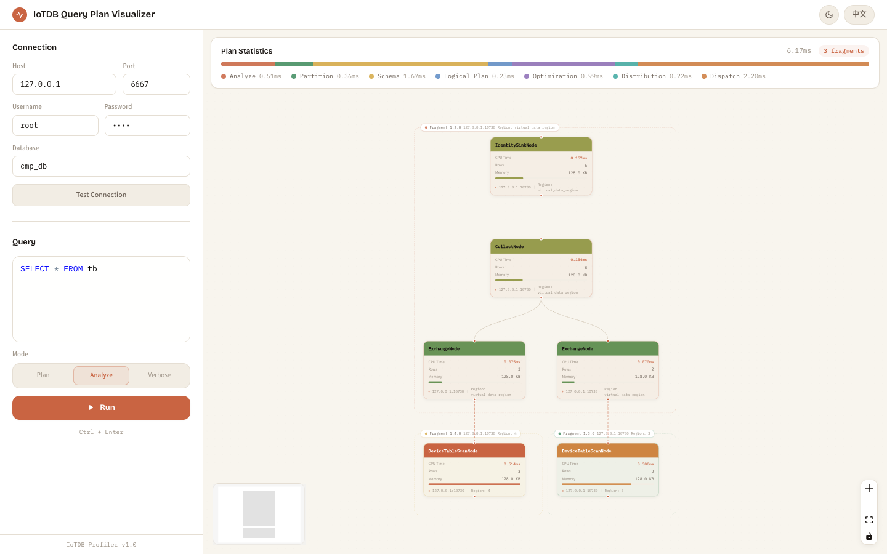
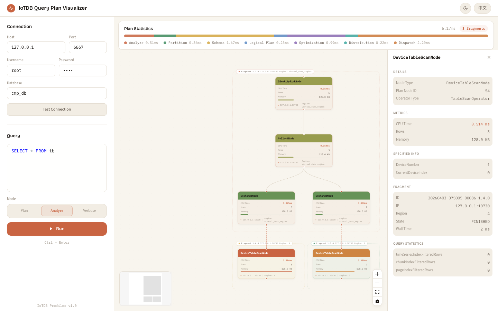

# IoTDB Query Plan Visualizer

A web-based tool for visualizing Apache IoTDB table-model query execution plans. Connect to any IoTDB instance, run SQL queries, and interactively explore the distributed execution plan tree.

Inspired by [PEV2](https://github.com/dalibo/pev2) (PostgreSQL Explain Visualizer), but designed for IoTDB's distributed architecture with multi-fragment plan visualization.

## Screenshots

### Dark Mode — EXPLAIN ANALYZE with Fragment Grouping


### Dark Mode — Node Detail Panel


### Light Mode — EXPLAIN ANALYZE


### Light Mode — Node Detail Panel


## Features

- **Three explain modes**: `EXPLAIN`, `EXPLAIN ANALYZE`, and `EXPLAIN ANALYZE VERBOSE`
- **Distributed plan visualization**: Automatically stitches multiple fragment instances into a unified tree
- **Fragment grouping**: Dashed bounding boxes with labels distinguish each query fragment (DataRegion, IP)
- **Interactive tree**: Pan, zoom, minimap, click-to-inspect powered by React Flow
- **Performance metrics**: CPU time, output rows, memory with color-coded heat mapping (green → amber → red)
- **Plan statistics banner**: Stacked bar chart showing planning phase breakdown
- **Dark / Light theme**: Toggle with automatic persistence
- **i18n**: English and Chinese interface

## Tech Stack

| Layer | Technology |
|-------|-----------|
| Backend | Spring Boot 3.4, Java 21, Maven |
| JDBC | Apache IoTDB JDBC 2.0.x |
| Frontend | React 19, TypeScript, Vite |
| Visualization | React Flow 12, Dagre |
| Styling | Tailwind CSS 4 |
| Editor | Monaco Editor |

## Prerequisites

- Java 21+
- Node.js 18+
- Maven 3.8+
- Apache IoTDB 2.0.x running and accessible
- IoTDB JDBC driver installed in local Maven repository

### Install IoTDB JDBC Driver

If using an IoTDB built from source:

```bash
cd /path/to/iotdb
mvn install -pl iotdb-client/jdbc -am -DskipTests
```

If using a released version, update `<iotdb.version>` in `backend/pom.xml` to match (e.g., `2.0.7`).

## Quick Start

### 1. Start the Backend

```bash
cd backend
mvn spring-boot:run
```

The backend starts on `http://localhost:8080`.

### 2. Start the Frontend

```bash
cd frontend
npm install
npm run dev
```

The frontend starts on `http://localhost:5173` with API proxy to the backend.

### 3. Use the App

1. Open `http://localhost:5173`
2. Enter IoTDB connection info (default: `127.0.0.1:6667`, `root/root`)
3. Enter the database name and SQL query
4. Select explain mode and click **Run**
5. Explore the execution plan tree — click nodes to see details

## Production Deployment

### Build

```bash
# Build frontend
cd frontend
npm install
npm run build

# Copy frontend dist to backend static resources
cp -r dist/* ../backend/src/main/resources/static/

# Build backend JAR
cd ../backend
mvn package -DskipTests
```

### Run

```bash
java -jar backend/target/iotdb-profiler-1.0.0-SNAPSHOT.jar
```

The application is available at `http://localhost:8080`.

### Configuration

The backend port can be changed via:

```bash
java -jar iotdb-profiler-1.0.0-SNAPSHOT.jar --server.port=9090
```

## Project Structure

```
iotdb-profiler/
├── backend/                          # Spring Boot backend
│   ├── pom.xml
│   └── src/main/java/.../profiler/
│       ├── ProfilerApplication.java  # Entry point
│       ├── config/WebConfig.java     # CORS configuration
│       ├── controller/QueryController.java
│       ├── dto/                      # Request/Response records
│       └── service/IoTDBQueryService.java  # JDBC logic
├── frontend/                         # React frontend
│   ├── package.json
│   ├── vite.config.ts                # Vite + API proxy
│   └── src/
│       ├── App.tsx                   # Main layout
│       ├── ThemeContext.tsx           # Dark/Light theme
│       ├── api/queryApi.ts           # Backend API client
│       ├── components/               # UI components
│       │   ├── ConnectionForm.tsx
│       │   ├── QueryEditor.tsx
│       │   ├── PlanStatsBanner.tsx
│       │   ├── PlanTree.tsx
│       │   ├── DetailPanel.tsx
│       │   └── nodes/
│       │       ├── OperatorNode.tsx   # Tree node card
│       │       └── FragmentGroup.tsx  # Fragment bounding box
│       ├── utils/
│       │   ├── treeBuilder.ts        # Fragment stitching algorithm
│       │   ├── layoutEngine.ts       # Dagre layout + overlap resolution
│       │   └── colorScale.ts         # Color mapping utilities
│       ├── types/                    # TypeScript type definitions
│       └── i18n/                     # en.json, zh.json
├── CLAUDE.md
└── README.md
```

## API Reference

### POST /api/test-connection

Test connectivity to an IoTDB instance.

**Request body:**
```json
{ "host": "127.0.0.1", "port": 6667, "username": "root", "password": "root" }
```

### POST /api/explain

Execute an EXPLAIN query and return the JSON plan.

**Request body:**
```json
{
  "host": "127.0.0.1", "port": 6667,
  "username": "root", "password": "root",
  "database": "mydb",
  "sql": "SELECT * FROM mytable",
  "mode": "EXPLAIN_ANALYZE"
}
```

**mode** values: `EXPLAIN`, `EXPLAIN_ANALYZE`, `EXPLAIN_ANALYZE_VERBOSE`

## License

Apache License 2.0
